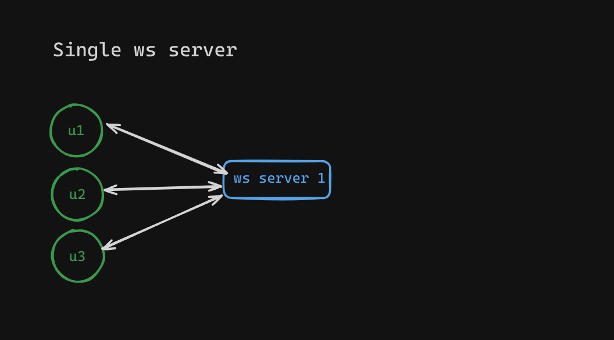
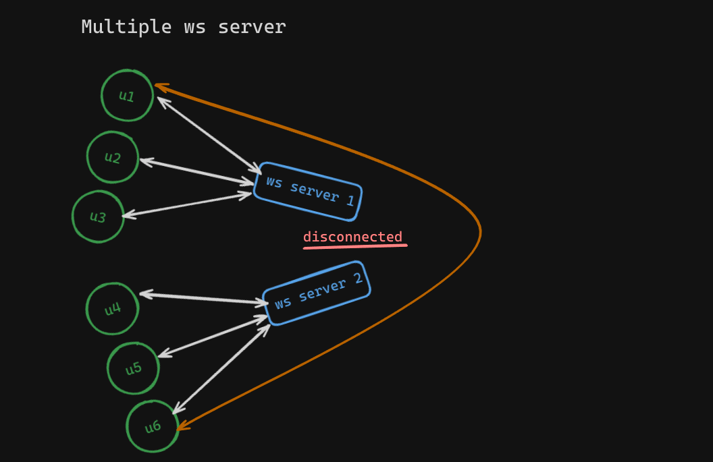
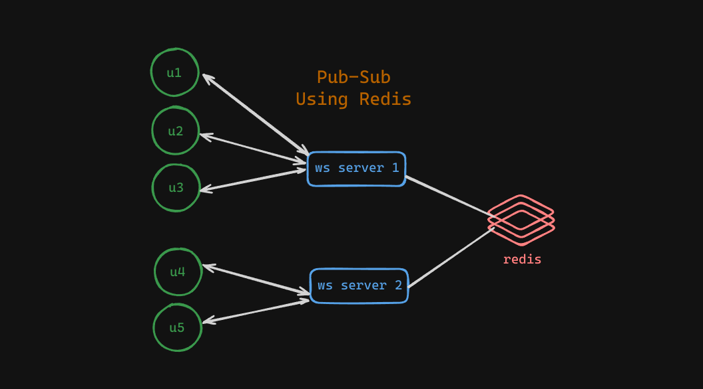

# Scaling websocket servers

Have you ever imagined how a large realtime websocker servers can be scaled ? Let's try to understand it by different scenarios.

## 1. Single WebSocket server

In this scenario you have limited number of users, which a single websocket server can easily handle without latency issues. But what if you got `1 million` users to your application & now you can't handle those with a single websocket server? You probable imagine that you can horizontally scale websocket servers. Let's try this.

## 2. Horizontal Scaling Of WebSocket Server

Now you have 2 instances of websocket server. Both are handling some amount of users. But in this scenario, `ws server 1` & `ws server 2` are not connected to each other via a ws protocol. Now the problem arises that how can a user connected from `ws server 1` communicate with a user connected to `ws server 2`. In this scenario there isn't was using a `u1` can communicate to `u2`.

## 3. Introducing Pub Sub (with REDIS)

REDIS's `pubsub` mechanism is one of the solution of the above problem.
Let's say in this scenario any user can type a message & it needs to be broadcasted to every user available on the platform. To do this connect `ws server 1` & `ws server 2` with the redis. When a user submits a message to its connected ws server, then that ws server publishes that message to a channel called `MESSAGE_CHANNEL` using redis. Also each ws server have subscribed to the same channed in order to receive the message from that channel. So when a message is published to the channel, all the ws servers subscribed to the channel `MESSAGE_CHANNEL` receive the message. Using this approach the message send by a user `u1` can be easily received by the users connected to the different ws server that `u1`, means `u4` and `u5` also received the broadcasted message from `u1`.
